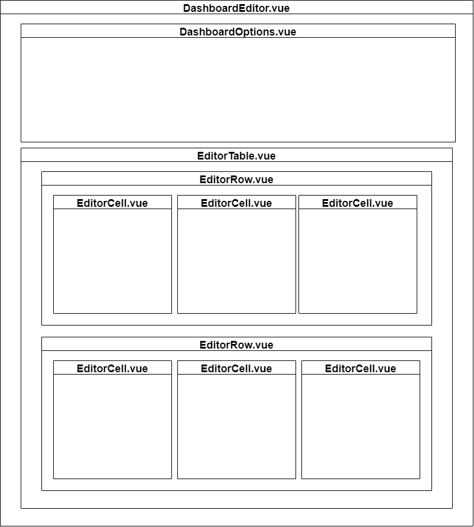

- # DashboardEditor.vue



The `DashboardEditor` component is a Vue component used to create and edit custom dashboard layouts. It provides a user interface for editing dashboard title, visibility (public/private), and adding, removing, or updating rows in the dashboard layout. It also allows users to save or cancel their changes.

## Props 
- `module` (Object, required): The module object containing utility methods and configuration data. 
- `dashboard` (Object, required): The dashboard object containing dashboard data such as title, body, and visibility. 
- `report` (Object, required): The report object containing report data. 
- `data_dictionary` (Object, required): The data dictionary object containing data dictionary data. 
- `report_fields_by_repeat_instrument` (Object, required): An object containing report fields by repeat instrument.
## Data 
- `title` (String): The title of the dashboard, taken from the `dashboard` prop. 
- `isPublic` (Boolean): The visibility of the dashboard, taken from the `dashboard` prop. 
- `body` (Array): The dashboard body, taken from the `dashboard` prop. 
- `localDashboard` (Object): The local copy of the dashboard object. 
- `savedModal` (Object): The saved modal object containing the properties: `name`, `list_link`, and `dash_link`.
## Components 
- `DashboardOptions`: The component for editing the dashboard title and visibility (public/private). 
- `EditorTable`: The component for editing the dashboard layout, including adding, removing, and updating rows. 
- `SavedModal`: The modal component displayed when the dashboard is successfully saved. 
- `ConfirmationModal`: The modal component displayed for confirming row deletion.
## Methods 
- `updateTitle(new_title)`: Updates the title of the dashboard. 
- `updatePublic(new_public)`: Updates the visibility of the dashboard. 
- `moveRowUp(index)`: Moves the row at the specified index up by one position. 
- `moveRowDown(index)`: Moves the row at the specified index down by one position. 
- `updateDashboardRow({ index, row })`: Updates the row at the specified index with the new row data. 
- `removeDashboardRow(index)`: Removes the row at the specified index. 
- `addDashboardRow()`: Adds a new row to the dashboard. 
- `saveDashboard()`: Saves the current state of the dashboard by either updating the existing dashboard or creating a new one. 
- `newDashboard()`: Creates a new dashboard object.
## Watchers 
- `body`: A deep watcher that updates the local `body` data property when the dashboard body changes.
## Dependencies 
- `DashboardOptions.vue` 
- `EditorTable.vue` 
- `SavedModal.vue` 
- `ConfirmationModal.vue`
## Utility Functions Imported 
- `getUuid`

- # EditorRow.vue

The `EditorRow` component is a Vue component used within the `DashboardEditor` for managing individual rows in the dashboard layout. It provides a user interface for adding, updating, moving, and deleting cells within a row, as well as moving and deleting the entire row.
## Usage

To use the `EditorRow` component, add it to your Vue component with the following template syntax:

```html

<editor-row :row="row" @updateRow="updateRowFunction" @moveRowUp="moveRowUpFunction" @moveRowDown="moveRowDownFunction" @removeRow="removeRowFunction"></editor-row>
```


Make sure to import the component and add it to the `components` object in the parent component's script:

```javascript

import EditorRow from './EditorRow.vue';

export default {
    components: {
        EditorRow,
    },
    // ...
};
```


## Props 
- `row` (Array, default: `null`): An array representing the row's cells in the dashboard layout.
## Computed Properties 
- `rowCells` (Array): A computed property that returns the `row` prop, or an empty array if the `row` prop is `null`.
## Components 
- `EditorCell`: The component for managing individual cells within the row.
## Methods 
- `addCell()`: Adds a new cell to the left of the row. 
- `updateCell(index, cell)`: Updates the cell at the specified index with the new cell data. 
- `moveCellLeft(index)`: Moves the cell at the specified index one position to the left. 
- `moveCellRight(index)`: Moves the cell at the specified index one position to the right. 
- `deleteCell(index)`: Deletes the cell at the specified index. 
- `addCellRight(index)`: Adds a new cell to the right of the cell at the specified index.
## Events 
- `updateRow`: Emits an updated row array after adding, updating, moving, or deleting cells. 
- `moveRowUp`: Emits an event to inform the parent component to move the row one position up. 
- `moveRowDown`: Emits an event to inform the parent component to move the row one position down. 
- `removeRow`: Emits an event to inform the parent component to remove the row.
## Dependencies 
- `EditorCell.vue`
## Styles 
- `.AG-editor-row-cells`: The CSS class for the container that holds all the cells within the row.

- # EditorCell.vue


The `EditorCell` component is a Vue component used within the `EditorRow` component for managing individual cells in the dashboard layout. It provides a user interface for selecting, configuring, previewing, and deleting a graph type, as well as moving and adding cells within a row.


## Props 
- `cell` (Object, default: `null`): An object representing the cell's graph type and configuration.
## Components 
- `GraphTypeSelector`: The component for selecting the graph type for the cell. 
- `ConfirmationModal`: The component for displaying a confirmation modal for deleting a cell.
## Emits 
- `updateCell`: Emits an updated cell object after selecting, configuring, or previewing a graph type. 
- `deleteCell`: Emits an event to inform the parent component to delete the cell. 
- `moveCellLeft`: Emits an event to inform the parent component to move the cell one position to the left. 
- `moveCellRight`: Emits an event to inform the parent component to move the cell one position to the right. 
- `addCellRight`: Emits an event to inform the parent component to add a new cell to the right of the current cell.
## Data 
- `currentGraphType`: The currently selected graph type. 
- `currentGraphForm`: The Vue component for the configuration form of the currently selected graph type. 
- `currentGraph`: The Vue component for displaying the graph of the currently selected graph type. 
- `cellData`: The cell's graph configuration data. 
- `cellID`: The cell's unique ID. 
- `graphId`: A unique ID used for re-rendering the graph component when necessary. 
- `showGraph`: A boolean indicating if the graph should be displayed. 
- `formReady`: A boolean indicating if the graph configuration form is ready for preview.
## Computed Properties 
- `availableGraphTypes` (Array): A computed property that returns an array of available graph types based on the current report fields.
## Methods 
- `graphTypeChange(graphType)`: Updates the selected graph type and creates the corresponding configuration form and graph components. 
- `createGraphFormFromSelectedGraphType(graphType)`: Creates the configuration form and graph components for the specified graph type. 
- `updateFormStatus(status)`: Updates the form readiness status based on the provided status. 
- `updateCellData(data)`: Updates the cell's graph configuration data and emits an updated cell object. 
- `previewGraph()`: Displays the graph preview. 
- `confirmDelete()`: Displays a confirmation modal for deleting the cell and emits a `deleteCell` event if confirmed.
## Dependencies 
- `GraphTypeSelector.vue` 
- `GraphTypes.js` 
- `ConfirmationModal.vue`

- # GraphTypes.js

- `GraphTypes.js` is a JavaScript module that imports and exports a set of Vue components related to various graph types. The file serves as a central location to define the available graph types and their associated form components used for configuration.
## Structure

The file starts by importing the required components for each supported graph type:
- BarGraphForm and BarGraph
- GroupedBarGraphForm and GroupedBarGraph
- LikertGraphForm and LikertGraph
- ScatterPlotForm and ScatterPlot
- TableForm and TableComponent
- MapsForm and Maps
- NetworkGraphForm and NetworkGraph
## Exports

The module exports an object containing key-value pairs for each graph type. The keys represent the internal identifier for the graph type, while the values are objects containing the associated form and graph components.

```javascript

export default {
    'bar_pie': {form: BarGraphForm, graph: BarGraph},
    'grouped_stacked': {form: GroupedBarGraphForm, graph: GroupedBarGraph},
    'scatter': {form: ScatterPlotForm, graph: ScatterPlot},
    'likert': {form: LikertGraphForm, graph: LikertGraph},
    'table': {form: TableForm, graph: TableComponent},
    'map': {form: MapsForm, graph: Maps},
    'network': {form: NetworkGraphForm, graph: NetworkGraph},
};
```


## Usage
This allows you to dynamically import and use the form and graph components for different graph types as needed.


- # BarGraph.vue


The `BarGraph` component is a Vue component used to display a bar or pie graph with optional titles and descriptions. The component makes use of the `Plot` library from `@observablehq/plot`, `d3`, and `d3-force` for generating the graph. It also imports utility functions from the `@/utils` module and two additional components, `BarGraphOptions` and `PieGraphOptions`, which provide configuration options for the respective graph types.
## Usage

To use the `BarGraph` component, add it to your Vue component with the following template syntax:

```html

<bar-graph :parameters="parameters" :editor-mode="editorMode" @updateParameters="handleUpdateParameters"></bar-graph>
```


## Props 
- `parameters` (Object, required): An object containing the parameters for the graph configuration. It should include the properties: `graph_type`, `title`, and `description`. 
- `editorMode` (Boolean, required): A boolean indicating if the component is in the editor mode. When `true`, the `moreOptionsComponent` will be displayed, allowing the user to configure the graph.
## Data 
- `title` (String): The title of the graph, taken from the `parameters` prop. 
- `description` (String): The description of the graph, taken from the `parameters` prop. 
- `graph` (Object): The graph object generated by the `getGraph` method. 
- `moreOptionsComponent` (VueComponent): The Vue component for configuring the graph (`BarGraphOptions` or `PieGraphOptions`, depending on the `graph_type`).
## Methods 
- `updateParameters(parameters)`: Updates the parameters and emits the `updateParameters` event with the new parameters. This method is called when the user updates the graph configuration using the `moreOptionsComponent`. 
- `updateGraph()`: Clears the current graph and generates a new one using the `getGraph` method. 
- `getGraph(parameters)`: A method that generates the graph based on the provided `parameters`. This method should be implemented with the appropriate logic for generating the desired graph type.
## Events 
- `updateParameters`: This event is emitted when the user updates the graph configuration using the `moreOptionsComponent`. The new parameters are passed as an argument.
## Slots

None.
## Dependencies 
- `@observablehq/plot` 
- `d3` 
- `d3-force` 
- `BarGraphOptions.vue` 
- `PieGraphOptions.vue`
## Utility Functions Imported 
- `parseChoicesOrCalculations` 
- `isCheckboxField` 
- `getCheckboxReport` 
- `getFieldLabel` 
- `wrapString` 
- `truncateString`


- ## BarGraphForm.vue

`BarGraphForm.vue` is a Vue component that presents a form for users to configure the parameters needed to create a bar or pie graph. The form contains various input fields and selectors for setting up the data source and display options for the graph.
### Template

The template section of the component contains the HTML structure for the form. It uses several custom components, such as `HelpfulParameter`, `InstrumentSelector`, `RadioComponent`, `CategoricalFieldSelector`, `NumericFieldSelector`, and `PaletteSelector`, to create the form fields.
### Script

The script section of the component imports the required custom components and utility functions, and defines the component properties, data, computed properties, and methods.
#### Component Imports 
- `HelpfulParameter`: A reusable form field component with a label and help text. 
- `InstrumentSelector`: A component for selecting the available instrument from which to gather data. 
- `RadioComponent`: A reusable radio button component for selecting options. 
- `CategoricalFieldSelector`: A component for selecting a categorical field from the data. 
- `NumericFieldSelector`: A component for selecting a numeric field from the data. 
- `PaletteSelector`: A component for selecting the color palette for the graph.
#### Props 
- `cellData`: An object containing the initial data for the form fields.
#### Data 
- `formData`: An object containing the current form data. Initialized with the `cellData` prop.
#### Computed Properties 
- `isFormReady`: A boolean indicating whether the form is complete and valid for graph creation. 
- `availableInstruments`: An object containing the available instruments that can be used to create a bar or pie graph.
#### Watchers 
- `isFormReady`: Emits the `isReady` event whenever the form's readiness state changes. 
- `formData`: Emits the `updateCellData` event whenever the form data changes.
#### Methods 
- `isCreatable`: Determines if at least one instrument in `report_fields_by_repeat_instrument` has a categorical field. 
- `instrumentCanCreate`: Determines if the specified instrument has a categorical field

- The described files interact with each other in the following manner: 
1. `GraphTypes.js`: This file serves as a central registry of available graph types and their corresponding form and graph components. It imports and exports the form and graph components for each graph type, including `BarGraphForm`, `BarGraph`, `GroupedBarGraphForm`, `GroupedBarGraph`, `LikertGraphForm`, `LikertGraph`, `ScatterPlotForm`, `ScatterPlot`, `TableForm`, `TableComponent`, `MapsForm`, `Maps`, `NetworkGraphForm`, and `NetworkGraph`. 
2. `BarGraphForm.vue`: This Vue component displays a form for the user to configure the parameters needed to create a bar or pie graph. The form consists of various input fields and selectors that are built using custom components such as `HelpfulParameter`, `InstrumentSelector`, `RadioComponent`, `CategoricalFieldSelector`, `NumericFieldSelector`, and `PaletteSelector`. 
3. `BarGraph.vue`: This Vue component takes the parameters provided by `BarGraphForm.vue` and renders the actual bar or pie graph based on the user's input. It processes the data and configuration options passed to it and uses a graphing library to render the desired graph.

The interplay between these files occurs as follows: 
- In the application, the user selects the desired graph type (e.g., a bar graph). Based on the user's selection, the application will load the corresponding form component from the `GraphTypes.js` registry (in this case, `BarGraphForm.vue`). 
- The `BarGraphForm.vue` component is then displayed, allowing the user to configure the graph parameters, such as the data source, categorical and numeric fields, aggregation function, and display options.
- As the user fills out the form, the component emits events to inform the parent component about the form's readiness status and the current form data. 
- Once the form is complete and valid, the parent component will load the corresponding graph component from the `GraphTypes.js` registry (in this case, `BarGraph.vue`). 
- The `BarGraph.vue` component will then receive the configured parameters from `BarGraphForm.vue` and render the desired graph based on the user's input.

Overall, the described files work together to provide a dynamic and interactive user interface for creating various types of graphs based on user input and available data sources.
